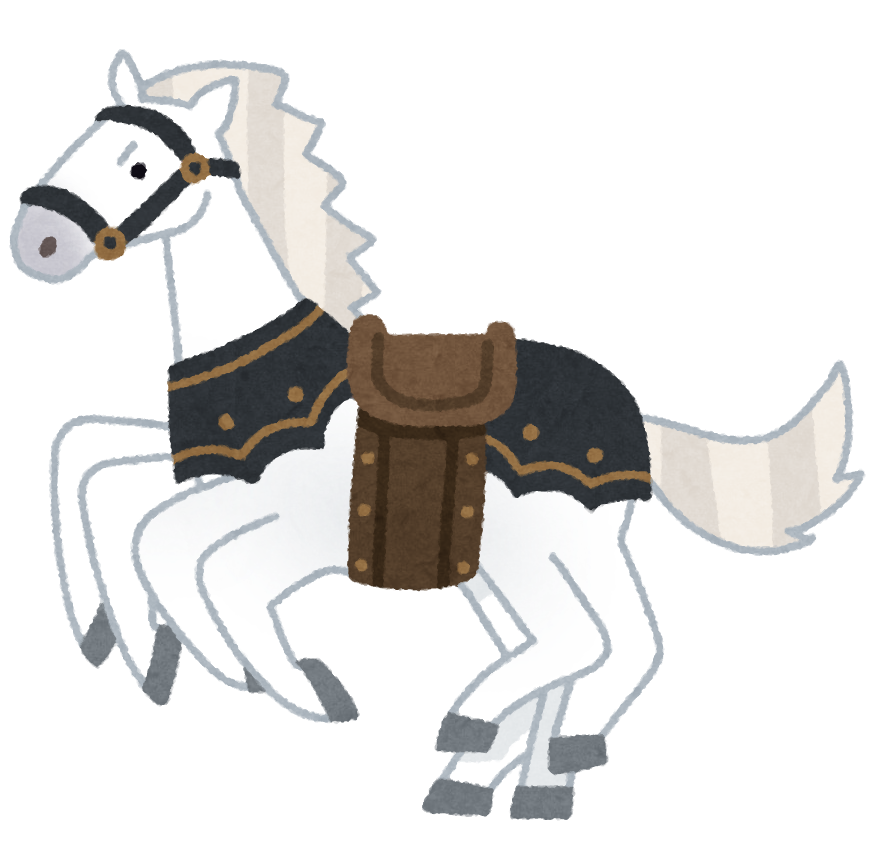

**こんにちは世界**

- レべル 0
- レべル 0
  - レべル 1 (半角スペース 1x2 = 2 個)
  - レべル 1
    - レべル 2 (半角スペース 2x2 = 4 個)
    - レべル 2
  - レベル 1
- レべル 0

1. レべル 0
1. レべル 0
   1. レベル 1 (半角スペース 1x3 = 3 個)
   1. レべル 1
      1. レべル 2 (半角スペース 2x3 = 6 個)
      1. レべル 2
   1. レべル 1
1. レべル 0

# レベル0

ほげ

## レベル1

ふが

### レベル2

ぴよ

ほげ[ふが](https://github.com/)ぴよ

